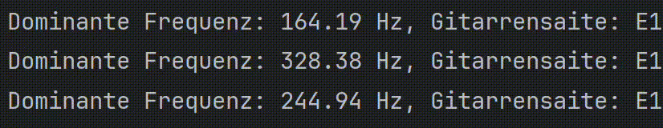

# GuitarTuner_FFT
Beschreibung

Dieses Python-Script nimmt Audio von einem Mikrofon auf, analysiert die Frequenzen und findet heraus, welche Gitarrensaite der erkannten Frequenz am nächsten kommt. Es nutzt die Fast Fourier Transformation (FFT), um die Frequenzen in Echtzeit zu berechnen und anzuzeigen. Das Programm läuft unbegrenzt, bis es manuell gestoppt wird.

